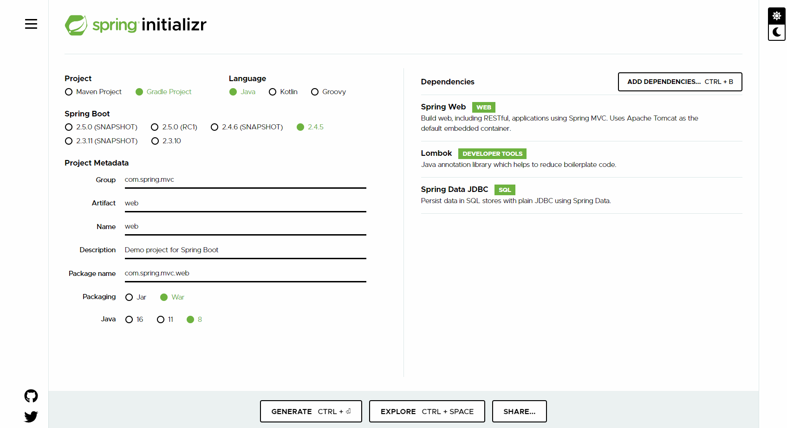

#스프링 설정

//jsp 라이브러리 추가
implementation 'javax.servlet:jstl'
implementation 'org.apache.tomcat.embed:tomcat-embed-jasper'

//maven repository
원래는 MyBatis와 MyBatis Spring을 모두 설치해야 하는데 요즘은 MyBatis Spring Boot Starter만 설치하면 됨

/*
<?xml version="1.0" encoding="UTF-8" ?>
<!DOCTYPE mapper
        PUBLIC "-//mybatis.org//DTD Mapper 3.0//EN"
        "http://mybatis.org/dtd/mybatis-3-mapper.dtd">
<mapper namespace="">

</mapper>
*/

//mybatis
https://mybatis.org/mybatis-3/index.html